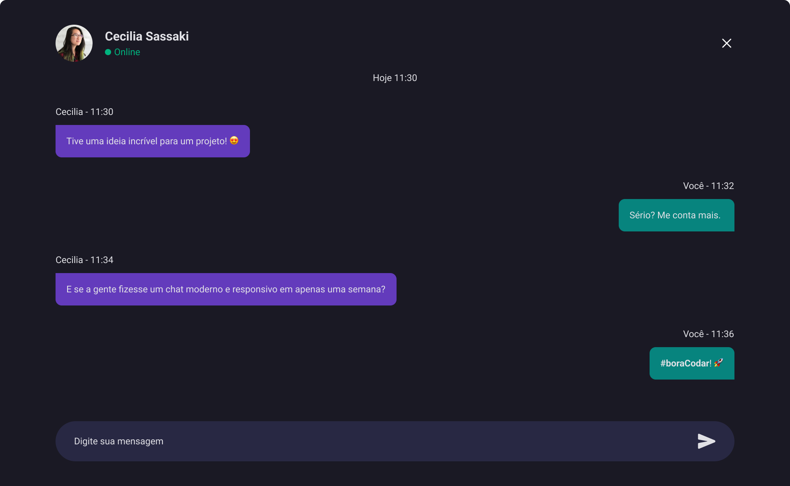

<h1 align="center">Chat</h1>

  <h3>
    <a href="https://eliel-souza.github.io/desafio04-bora-codar/">
      Site
    </a>
  </h3>

&nbsp;

## Sobre o Projeto

O desafio é criar um chat mobile/desktop responsivo, e deixá-lo o mais próximo possível do design.
Você pode usar qualquer ferramenta que desejar para ajudá-lo a concluir o desafio.

## Construído com

- HTML5
- BEM
- CSS
- Flexbox
- Grid
- Mobile-first
